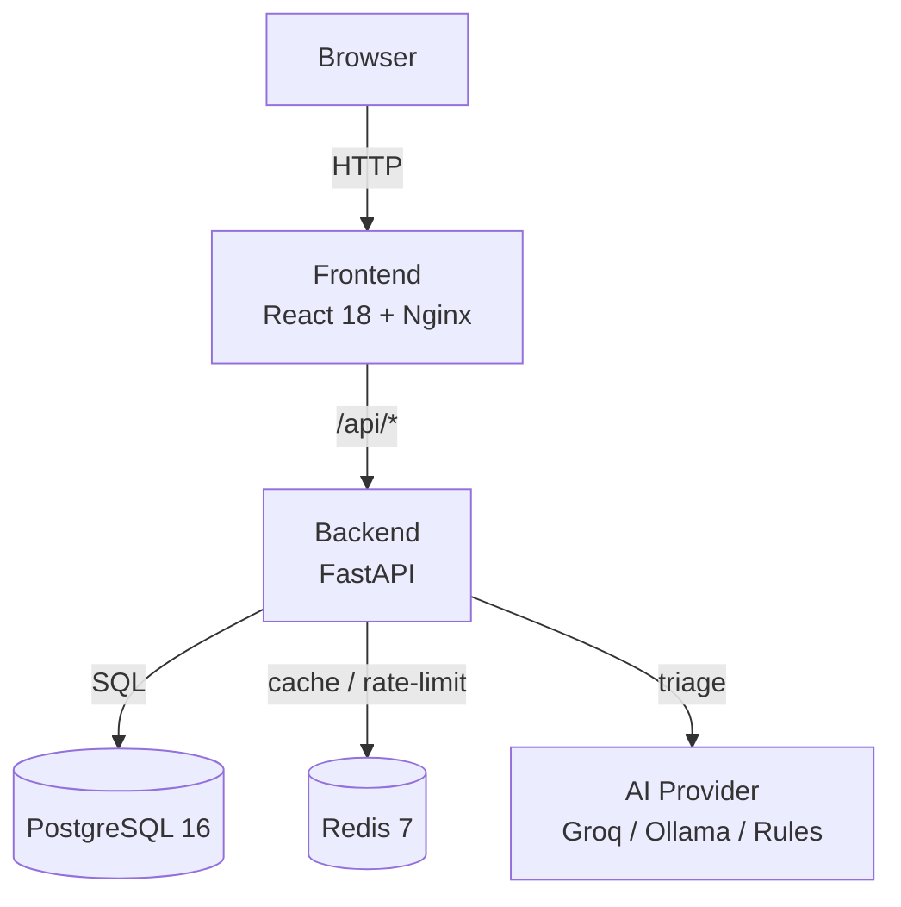

# CivicPulse

> **CS4032 Software Construction and Design — Assignment 01**

[](https://github.com/includeduck/SCD-civicpulse/actions/workflows/ci.yml)
[](https://github.com/includeduck/SCD-civicpulse/actions/workflows/cd.yml)
[](LICENSE)

## Problem Statement

Municipal residents have no simple, accessible channel to report infrastructure issues (potholes, power outages, broken streetlights, sanitation problems). CivicPulse provides a public complaint-intake portal with AI-powered triage that categorises and prioritises complaints, routes them to the right departments, and gives operations staff a real-time dashboard.

---

## Architecture



---

## Quick Start (local)

```bash
# 1. Clone
git clone https://github.com/includeduck/SCD-civicpulse.git
cd SCD-civicpulse

# 2. Configure
cp .env.example .env
# Edit .env as needed (defaults work for local dev with simulated triage)

# 3. Start everything
docker compose up --build

# 4. Open
#   Frontend  → http://localhost:80
#   API docs  → http://localhost:8000/docs
#   Metrics   → http://localhost:8000/metrics
```

---

## API Reference

| Method | Path | Description |
|--------|------|-------------|
| `POST` | `/api/complaints` | Submit a new complaint (rate-limited, AI-triaged) |
| `GET` | `/api/complaints` | List complaints (filterable, paginated) |
| `GET` | `/api/complaints/{id}` | Get a single complaint |
| `PATCH` | `/api/complaints/{id}/status` | Transition complaint status |
| `GET` | `/api/stats` | Aggregate stats (Redis-cached, 30 s TTL) |
| `GET` | `/api/meta/providers` | Triage provider info and metrics |
| `GET` | `/health` | Liveness probe (no DB) |
| `GET` | `/ready` | Readiness probe (checks PG + Redis) |
| `GET` | `/metrics` | Prometheus metrics |

---

## Kubernetes (local)

```bash
# Requires k3d or kind installed
./scripts/k8s-up.sh          # create cluster + deploy
kubectl -n civicpulse get all
```

---

## Screenshots

> *Screenshots will be added as part of Phase 15 documentation.*

---

## Team

| Member | GitHub |
|--------|--------|
| Member 1 | [@includeduck](https://github.com/includeduck) |
| Member 2 | *TBD* |

---

## Docs

- [Engineering Notes](docs/ENGINEERING-NOTES.md)
- [Runbook](docs/RUNBOOK.md)
- [AI Usage](docs/AI-USAGE.md)
- [Triage Design](docs/TRIAGE.md)
- [ADR 0001 — Provider Interface](docs/adr/0001-provider-interface.md)
- [ADR 0002 — Frontend Runtime Config](docs/adr/0002-frontend-runtime-config.md)
- [ADR 0003 — Deploy by SHA](docs/adr/0003-deploy-by-sha.md)
- [ADR 0004 — PII and Data Governance](docs/adr/0004-pii-and-data-governance.md)
