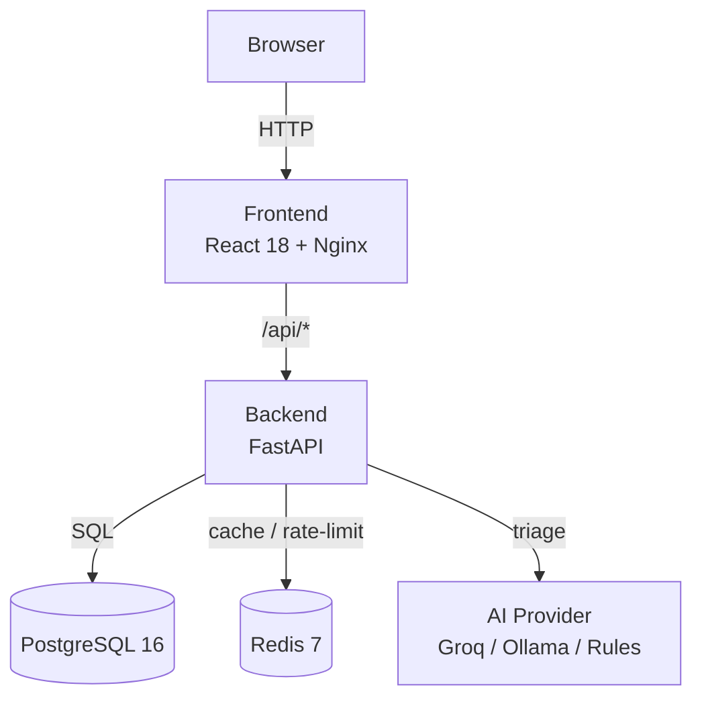

# CivicPulse

> **CS4032 Software Construction and Design — Assignment 01**

<!-- CI/CD badges are added in Phases 13–14, once .github/workflows/ci.yml and cd.yml exist. -->
[](LICENSE)

## Problem Statement

Municipal residents have no simple, accessible channel to report infrastructure issues (potholes, power outages, broken streetlights, sanitation problems). CivicPulse provides a public complaint-intake portal with AI-powered triage that categorises and prioritises complaints, routes them to the right departments, and gives operations staff a real-time dashboard.

---

## Architecture


```mermaid
graph TD
    Browser -->|HTTP| FE[Frontend\nReact 18 + Nginx]
    FE -->|/api/*| BE[Backend\nFastAPI]
    BE -->|SQL| PG[(PostgreSQL 16)]
    BE -->|cache / rate-limit| RD[(Redis 7)]
    BE -->|triage| AI[AI Provider\nGroq / Ollama / Rules]
```

---

## Quick Start (local)

> **Not available yet.** `compose.yaml` arrives in Phase 9. Until then, run the backend directly — see [Backend Development](#backend-development). The steps below are the target workflow.

```bash
# 1. Clone
git clone https://github.com/includeduck/SCD-civicpulse.git
cd SCD-civicpulse

# 2. Configure
cp .env.example .env
# Edit .env as needed (defaults work for local dev with simulated triage)

# 3. Start everything
docker compose up --build

# 4. Open
#   Frontend  → http://localhost:80
#   API docs  → http://localhost:8000/docs
#   Metrics   → http://localhost:8000/metrics
```

---

## Backend Development

Run the backend outside Docker for faster iteration (Python 3.12+):

```bash
cd backend
pip install -e ".[dev]"

# Apply database migrations (uses DATABASE_URL from .env)
alembic upgrade head

# Seed ~32 sample complaints (idempotent — safe to re-run)
python -m scripts.seed_db

# Run the API with hot reload
uvicorn app.main:app --reload

# Lint and test (coverage report included)
ruff check .
pytest
```

The backend follows a 4-layer architecture: **routes → services → repositories → models**, with AI triage behind a provider interface in `app/providers/triage/`.

---

## Project Status

| Phase | Scope | Status |
|-------|-------|--------|
| 0 | Repository and team workflow | ✅ Done |
| 1 | Backend foundation (FastAPI, config, logging, health probes) | ✅ Done |
| 2 | Database models, Alembic migrations, repositories, seed | ✅ Done |
| 3 | Complaint domain and API | ⏳ Next |
| 4–7 | Triage providers, Redis cache/rate limiting, observability | 🔜 Planned |
| 8–9 | Frontend, Docker Compose | 🔜 Planned |
| 10–15 | Tests, Kubernetes, CI/CD, documentation | 🔜 Planned |

See [CivicPulse_ImplementationPlan.md](CivicPulse_ImplementationPlan.md) for the full plan.

---

## API Reference

| Method | Path | Description | Status |
|--------|------|-------------|--------|
| `POST` | `/api/complaints` | Submit a new complaint (rate-limited, AI-triaged) | Phase 3 |
| `GET` | `/api/complaints` | List complaints (filterable, paginated) | Phase 3 |
| `GET` | `/api/complaints/{id}` | Get a single complaint | Phase 3 |
| `PATCH` | `/api/complaints/{id}/status` | Transition complaint status | Phase 3 |
| `GET` | `/api/stats` | Aggregate stats (Redis-cached, 30 s TTL) | Phase 3/6 |
| `GET` | `/api/meta/providers` | Triage provider info and metrics | ✅ |
| `GET` | `/health` | Liveness probe (no DB) | ✅ |
| `GET` | `/ready` | Readiness probe (checks PG + Redis) | ✅ |
| `GET` | `/metrics` | Prometheus metrics | ✅ |

Invalid input returns `400` with field-level errors; invalid status transitions return `409`; rate-limited requests return `429` with `Retry-After`.

---

## Kubernetes (local)

> **Not available yet** — manifests and `scripts/k8s-up.sh` arrive in Phases 11–12.

```bash
# Requires k3d or kind installed
./scripts/k8s-up.sh          # create cluster + deploy
kubectl -n civicpulse get all
```

---

## Screenshots

> *Screenshots will be added as part of Phase 15 documentation.*

---

## Team

| Member | GitHub |
|--------|--------|
| Member 1 | [@includeduck](https://github.com/includeduck) |
| Member 2 | *TBD* |

---

## Docs

- [Engineering Notes](docs/ENGINEERING-NOTES.md)
- [Runbook](docs/RUNBOOK.md)
- [AI Usage](docs/AI-USAGE.md)
- [Triage Design](docs/TRIAGE.md)
- [ADR 0001 — Provider Interface](docs/adr/0001-provider-interface.md)
- [ADR 0002 — Frontend Runtime Config](docs/adr/0002-frontend-runtime-config.md)
- [ADR 0003 — Deploy by SHA](docs/adr/0003-deploy-by-sha.md)
- [ADR 0004 — PII and Data Governance](docs/adr/0004-pii-and-data-governance.md)
