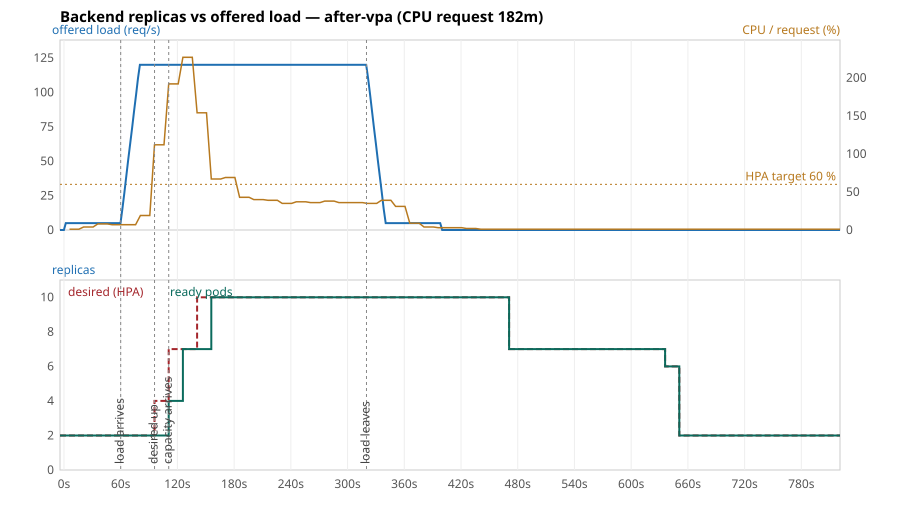

# Load test `after-vpa`

CPU request per backend pod: `182m`. Offered load: 5 req/s, then 120 req/s from t = 60 s to t = 320 s (`load/k6-script.js`, arrival-rate executor). t = 0 is when k6 started.

| Event | t | Lag after the load arrived |
|---|---|---|
| Load starts rising | 60 s | |
| HPA first sees CPU above 60 % | 96 s | **36 s** |
| HPA raises desired replicas | 96 s | **36 s** |
| First extra pod Ready (capacity arrives) | 111 s | **51 s** |
| Peak of 10 ready pods | 156 s | **96 s** |
| Load leaves | 320 s | |
| HPA starts scaling in | 471 s | 151 s after the load left |

Peak CPU utilisation reported by the HPA: 227 % of request.

| k6 | |
|---|---|
| Requests | 31,887 |
| Failed | 0.00 % |
| p95 / p99 / max latency | 21 / 251 / 1753 ms |

