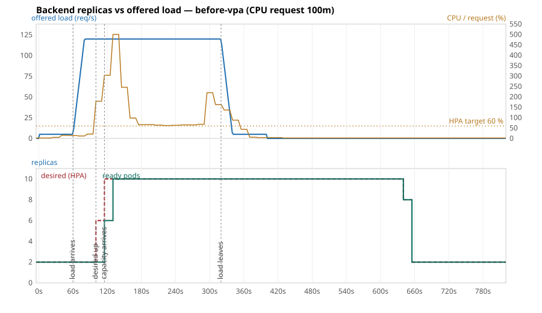

# Load test `before-vpa`

CPU request per backend pod: `100m`. Offered load: 5 req/s, then 120 req/s from t = 60 s to t = 320 s (`load/k6-script.js`, arrival-rate executor). t = 0 is when k6 started.

| Event | t | Lag after the load arrived |
|---|---|---|
| Load starts rising | 60 s | |
| HPA first sees CPU above 60 % | 100 s | **40 s** |
| HPA raises desired replicas | 100 s | **40 s** |
| First extra pod Ready (capacity arrives) | 115 s | **55 s** |
| Peak of 10 ready pods | 130 s | **70 s** |
| Load leaves | 320 s | |
| HPA starts scaling in | 640 s | 320 s after the load left |

Peak CPU utilisation reported by the HPA: 500 % of request.

| k6 | |
|---|---|
| Requests | 31,652 |
| Failed | 0.00 % |
| p95 / p99 / max latency | 1148 / 3213 / 5840 ms |

